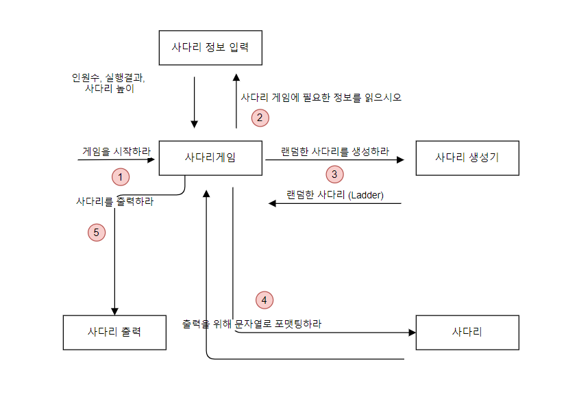

# 목차

- [Java Ladder](#Java-Ladder)
- [학습목표](#학습목표)

# Java Ladder

- Last Update: 2022-3-15

## Todolist

- [x] 기존 브릿지의 값(true/false)을 담는 길이를 인원수-1에서 인원수*2-1로 변경
- [x] 사다리 타기 알고리즘 구현
- [x] 사다리 실행 결과 입력
- [x] 개인별 이름 입력시 개인 사다리 결과 출력
- [x] 전체 참여자 실행 결과 출력
- [x] 프로그램 종료기능
- [x] 사다리 타기 알고리즘 depth2->depth1로 줄이기

## 기능요구사항

- 사다리 게임
    - [x] n명의 사람과 m개의 사다리 높이의 사용자 입력
        - 사람은 최소 2명 이상이어야 합니다.
        - 사다리의 최소 높이는 1 이상이어야 합니다.
        - 사용자가 입력에 맞지 않은 범위나 문자 입력시 경고 메시지 출력후 다시 입력하게 합니다.
    - [x] 랜덤한 사다리 라인 생성
        - 사다리 라인 : `"-"`
        - 사다리 라인 없음 : `" "`(공백 문자)
        - 사다리 기둥 : `"|"`
    - [x] 사다리 출력
        - 출력시 이름도 같이 출력되어야 합니다.
    - [x] 사다리 게임에 참여하는 사용자 이름 입력
        - 사용자의 이름은 최대 5글자까지 부여할 수 있습니다.
        - 사용자 이름 입력시 쉼표(,)를 기준으로 구분합니다.
        - ex) pobi,honux,crong,jk
    - [x] 사다리의 브릿지(-----)가 한 라인에 2개 이상 연속으로 이어지면 안됩니다.
    - [x] 사다리 실행 결과 입력
        - ex) "꽝,5000,꽝,3000"과 같은 입력시 실행 결과 입력됩니다.
    - [x] 사다리 실행 결과 출력
    - [x] 개인별 이름 입력시 개인별 사다리 결과 출력
    - [x] 전체 참여자 실행 결과 출력
    - [x] 프로그램 종료 기능

## 프로그래밍 요구사항

- 메서드 크기는 최대 10라인입니다.
- 메서드가 한 가지 일만 하도록 합니다.
- else를 사용하지 마십시오.
- ArrayList와 Generic을 활용하십시오.
- setter 메소드를 사용하지 않고 구현
    - 단, DTO는 setter를 사용해도 괜찮습니다.
- 실행 결과의 개수는 참여할 사람 이름의 인원수와 동일해야합니다.
- 각각의 실행 결과의 길이는 최소 1글자, 최대 5글자여야 합니다.
- 실행 결과 입력
    - `참여자 이름` : 참여자의 실행 결과 출력
    - `all` : 전체 참여자 실행 결과 출력
    - `춘식이` : 프로그램 종료
- 결과를 보고 싶은 사람 적절하지 않은 이름 입력시 경고 메시지를 출력후 다시 입력하게 합니다.

## 예상 결과 및 동작 예시

```
참여할 사람 이름을 입력하세요. (이름은 쉼표(,)로 구분하세요)
pobi,honux,crong,jk

실행 결과를 입력하세요. (결과는 쉼표(,)로 구분하세요)
꽝,5000,꽝,3000

최대 사다리 높이는 몇 개인가요?
5

사다리 결과

   pobi  honux crong   jk
    |-----|     |-----|
    |     |-----|     |
    |-----|     |     |
    |     |-----|     |
    |-----|     |-----|
   꽝    5000  꽝    3000

결과를 보고 싶은 사람은?
all : 전체 결과 보기, 춘식이 : 프로그램 종료, 이름 : pobi  honux crong jk
pobi

실행 결과
pobi : 꽝

결과를 보고 싶은 사람은?
all : 전체 결과 보기, 춘식이 : 프로그램 종료, 이름 : pobi  honux crong jk
all

실행 결과
pobi  : 꽝
honux : 3000
crong : 꽝
jk    : 5000

결과를 보고 싶은 사람은?
춘식이

게임을 종료합니다.
```

```
참여할 사람 이름을 입력하세요. (이름은 쉼표(,)로 구분하세요)
pobi,honux,crong,jkawoeifnoawefn
참여할 사람의 이름은 영어 최대 5글자로 구성되어야 합니다. 다시 입력해주세요

참여할 사람 이름을 입력하세요. (이름은 쉼표(,)로 구분하세요)
pobi
참여할 사람은 최소 2명 이상이어야 합니다. 다시 입력해주세요.

참여할 사람 이름을 입력하세요. (이름은 쉼표(,)로 구분하세요)
pobi123, jk
참여할 사람의 이름은 영어 최대 5글자로 구성되어야 합니다. 다시 입력해주세요

참여할 사람 이름을 입력하세요. (이름은 쉼표(,)로 구분하세요)
pobi,honux,crong,jk

실행 결과를 입력하세요. (결과는 쉼표(,)로 구분하세요)
꽝,5000
실행결과의 개수는 참여할 사람 이름수와 동일해야 합니다. 개수 : 4

실행 결과를 입력하세요. (결과는 쉼표(,)로 구분하세요)
꽝,5000,꽝,3000

최대 사다리 높이는 몇 개인가요?
abc
적절하지 않은 입력입니다. 1 이상의 사다리 높이를 입력해주세요.

최대 사다리 높이는 몇 개인가요?
5

사다리 결과

   pobi  honux crong   jk
    |-----|     |-----|
    |     |-----|     |
    |-----|     |     |
    |     |-----|     |
    |-----|     |-----|
   꽝    5000  꽝    3000

결과를 보고 싶은 사람은?
all : 전체 결과 보기, 춘식이 : 프로그램 종료, 이름 : pobi  honux crong jk
iawoejfoia
해당 사람은 사다리 게임 이름에 없습니다. 다시 입력해주세요.
 
결과를 보고 싶은 사람은?
all : 전체 결과 보기, 춘식이 : 프로그램 종료, 이름 : pobi  honux crong jk
pobi

실행 결과
pobi : 꽝

결과를 보고 싶은 사람은?
all : 전체 결과 보기, 춘식이 : 프로그램 종료, 이름 : pobi  honux crong jk
all

실행 결과
pobi  : 꽝
honux : 3000
crong : 꽝
jk    : 5000

결과를 보고 싶은 사람은?
all : 전체 결과 보기, 춘식이 : 프로그램 종료, 이름 : pobi  honux crong jk
춘식이

게임을 종료합니다. 
```

## 패키지 구조

```shell
├─main
│  └─java
│      │  .gitkeep
│      │
│      └─kr
│          └─codesquad
│              └─ladder
│                  │  Main.java
│                  │
│                  ├─controller
│                  │      LadderConsoleReaderController.java
│                  │      LadderGame.java
│                  │
│                  ├─domain
│                  │      Destination.java
│                  │      Destinations.java
│                  │      Ladder.java
│                  │      LadderGenerator.java
│                  │      LadderResult.java
│                  │      Name.java
│                  │      Names.java
│                  │      Point.java
│                  │      Points.java
│                  │
│                  ├─exception
│                  │      InvalidContainOfNamesException.java
│                  │      InvalidCountOfLadderResultException.java
│                  │      InvalidCountOfPeopleException.java
│                  │      InvalidFormatOfDestinationException.java
│                  │      InvalidNameFormatOfPeopleException.java
│                  │      InvalidNumberOfMinimumLadderHeightException.java
│                  │
│                  └─view
│                          LadderConsoleReader.java
│                          LadderConsoleWriter.java
│                          LadderReader.java
│                          LadderWriter.java
│
└─test
    └─java
        │  .gitkeep
        │
        └─kr
            └─codesquad
                └─ladder
                    │  MainTest.java
                    │
                    ├─controller
                    ├─domain
                    │      DestinationsTest.java
                    │      LadderGeneratorTest.java
                    │      LadderTest.java
                    │      NamesTest.java
                    │      NameTest.java
                    │
                    └─view
                            LadderConsoleReaderTest.java
```

## 도메인 모델



## 빌드 및 실행

```shell
$ ./gradlew build
$ java -jar ./build/libs/java-lotto-1.0-SNAPSHOT.jar
참여할 사람 이름을 입력하세요. (이름은 쉼표(,)로 구분하세요)
pobi
참여할 사람은 최소 2명 이상이어야 합니다. 다시 입력해주세요.
참여할 사람 이름을 입력하세요. (이름은 쉼표(,)로 구분하세요)
pobi,houawioefjoawie
참여할 사람의 이름은 영어 최대 5글자로 구성되어야 합니다. 다시 입력해주세요
참여할 사람 이름을 입력하세요. (이름은 쉼표(,)로 구분하세요)
pobi,hounx
실행 결과를 입력하세요. (결과는 쉼표(,)로 구분하세요)
1000
실행결과의 개수는 참여할 사람 이름수와 동일해야 합니다. 개수 : 2
실행 결과를 입력하세요. (결과는 쉼표(,)로 구분하세요)
1000, awioefjoaw
실행결과의 길이는 최대 5글자입니다. 다시 입력해주세요.
실행 결과를 입력하세요. (결과는 쉼표(,)로 구분하세요)
1000, 2000
최대 사다리 높이는 몇 개인가요?
-1
적절하지 않은 입력입니다. 1 이상의 사다리 높이를 입력해주세요.
최대 사다리 높이는 몇 개인가요?
5
pobi  hounx
|-----|
|     |
|     |
|     |
|-----|
1000 2000 
결과를 보고 싶은 사람은?
all : 전체 결과 보기, 춘식이 : 프로그램 종료, 이름 : pobi  hounx
pobi
실행 결과
pobi  : 1000
결과를 보고 싶은 사람은?
all : 전체 결과 보기, 춘식이 : 프로그램 종료, 이름 : pobi  hounx
all
실행 결과
pobi  : 1000
hounx : 2000

결과를 보고 싶은 사람은?
all : 전체 결과 보기, 춘식이 : 프로그램 종료, 이름 : pobi  hounx
춘식이
프로그램을 종료합니다.
```

## 어려웠던 점 혹은 고민점

- buildRandomBridge 메서드 실행시 두 조건에서 첫번째 조건이 false인 경우 두번째 조건 표현식을 수행하지 않아서
  문제가 있었습니다.
    - 조건문을 따로 나누어서 두 조건문의 표현식이 전부 실행될 수 있도록 개선하였습니다.
- 사다리의 실행 결과를 사다리의 마지막 라인과 맞추기 위해 5글자로 제한해야 할까
    - 요구사항에 실행 결과명의 최대 글자를 추가하였습니다.

# [학습목표](https://gist.github.com/yonghwankim-dev/c3bcdfa0e8ef40f2d9c9d8c94034f36f)

- [x] String, StringBuilder, StringBuffer 비교
- [x] String과 new String() 차이
- [x] Return Early Pattern
- [x] private 메서드 테스트 지양해야 하는 이유 학습
- [x] 클린 코딩 기초 학습
- [x] static 메서드와 인스턴스 메서드의 비교
- [x] 객체지향생활체조 원칙
- [x] TDD Basic
- [ ] Java Exception
- [ ] Java Enum
- [ ] SparkJava
- [ ] JVM
- [x] http network 5장
- [ ] http network 6장
- [x] 이것이 안드로이드다, 스레드와 코루틴
- [ ] 이것이 안드로이드다, 서비스와 콘텐트 리졸버
