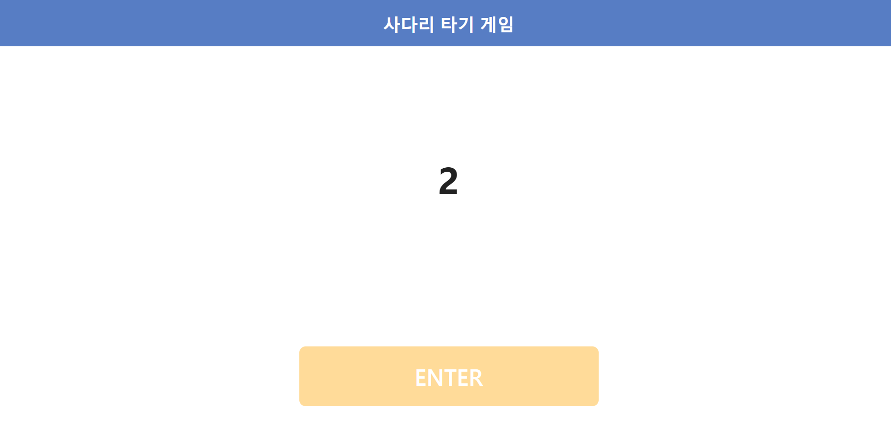
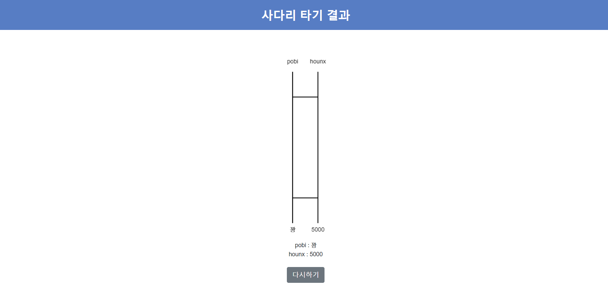
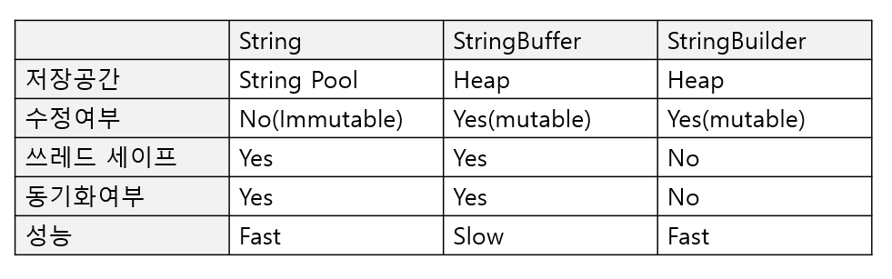
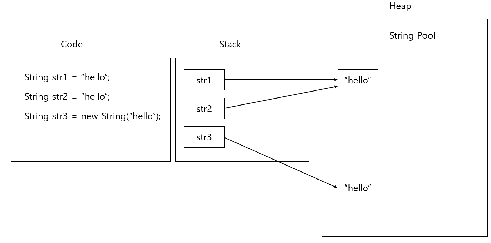
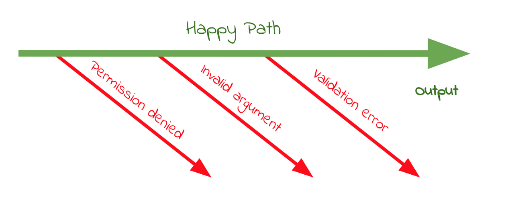
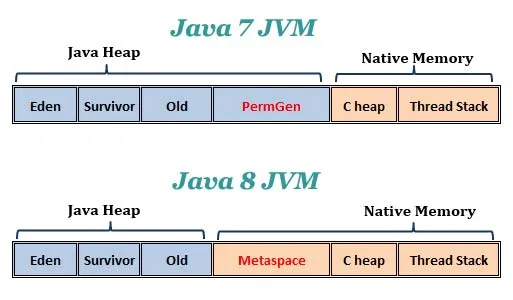
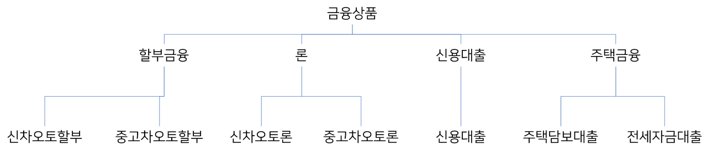

# 목차

- [Java Ladder](#Java-Ladder)
- [학습목표](#학습목표)

# Java Ladder

- Last Update: 2022-3-10

## Todolist

- [x] 기존 브릿지의 값(true/false)을 담는 길이를 인원수-1에서 인원수*2-1로 변경
- [x] 사다리 타기 알고리즘 구현
- [x] 사다리 실행 결과 입력
- [ ] 개인별 이름 입력시 개인 사다리 결과 출력
- [ ] 전체 참여자 실행 결과 출력
- [ ] 프로그램 종료기능
- [ ] 사다리 타기 알고리즘 depth2->depth1로 줄이기

## 기능요구사항

- 사다리 게임
    - [x] n명의 사람과 m개의 사다리 높이의 사용자 입력
        - 사람은 최소 2명 이상이어야 합니다.
        - 사다리의 최소 높이는 1 이상이어야 합니다.
        - 사용자가 입력에 맞지 않은 범위나 문자 입력시 경고 메시지 출력후 다시 입력하게 합니다.
    - [x] 랜덤한 사다리 라인 생성
        - 사다리 라인 : `"-"`
        - 사다리 라인 없음 : `" "`(공백 문자)
        - 사다리 기둥 : `"|"`
    - [x] 사다리 출력
        - 출력시 이름도 같이 출력되어야 합니다.
    - [x] 사다리 게임에 참여하는 사용자 이름 입력
        - 사용자의 이름은 최대 5글자까지 부여할 수 있습니다.
        - 사용자 이름 입력시 쉼표(,)를 기준으로 구분합니다.
        - ex) pobi,honux,crong,jk
    - [x] 사다리의 브릿지(-----)가 한 라인에 2개 이상 연속으로 이어지면 안됩니다.
    - [x] 사다리 실행 결과 입력
        - ex) "꽝,5000,꽝,3000"과 같은 입력시 실행 결과 입력됩니다.
    - [ ] 사다리 실행 결과 출력
    - [ ] 개인별 이름 입력시 개인별 사다리 결과 출력
    - [ ] 전체 참여자 실행 결과 출력
    - [ ] 프로그램 종료 기능

## 프로그래밍 요구사항

- 메서드 크기는 최대 10라인입니다.
- 메서드가 한 가지 일만 하도록 합니다.
- else를 사용하지 마십시오.
- ArrayList와 Generic을 활용하십시오.
- setter 메소드를 사용하지 않고 구현
    - 단, DTO는 setter를 사용해도 괜찮습니다.
- 실행 결과의 개수는 참여할 사람 이름의 인원수와 동일해야합니다.
- 각각의 실행 결과의 길이는 최소 1글자, 최대 5글자여야 합니다.
- 실행 결과 입력
    - `참여자 이름` : 참여자의 실행 결과 출력
    - `all` : 전체 참여자 실행 결과 출력
    - `춘식이` : 프로그램 종료
- 결과를 보고 싶은 사람 적절하지 않은 이름 입력시 경고 메시지를 출력후 다시 입력하게 합니다.

## 예상 결과 및 동작 예시

```
참여할 사람 이름을 입력하세요. (이름은 쉼표(,)로 구분하세요)
pobi,honux,crong,jk

실행 결과를 입력하세요. (결과는 쉼표(,)로 구분하세요)
꽝,5000,꽝,3000

최대 사다리 높이는 몇 개인가요?
5

사다리 결과

   pobi  honux crong   jk
    |-----|     |-----|
    |     |-----|     |
    |-----|     |     |
    |     |-----|     |
    |-----|     |-----|
   꽝    5000  꽝    3000

결과를 보고 싶은 사람은?
pobi

실행 결과
꽝

결과를 보고 싶은 사람은?
all

실행 결과
pobi : 꽝
honux : 3000
crong : 꽝
jk : 5000

결과를 보고 싶은 사람은?
춘식이

게임을 종료합니다.
```

```
참여할 사람 이름을 입력하세요. (이름은 쉼표(,)로 구분하세요)
pobi,honux,crong,jkawoeifnoawefn
참여할 사람의 이름은 영어 최대 5글자로 구성되어야 합니다. 다시 입력해주세요

참여할 사람 이름을 입력하세요. (이름은 쉼표(,)로 구분하세요)
pobi
참여할 사람은 최소 2명 이상이어야 합니다. 다시 입력해주세요.

참여할 사람 이름을 입력하세요. (이름은 쉼표(,)로 구분하세요)
pobi123, jk
참여할 사람의 이름은 영어 최대 5글자로 구성되어야 합니다. 다시 입력해주세요

참여할 사람 이름을 입력하세요. (이름은 쉼표(,)로 구분하세요)
pobi,honux,crong,jk

실행 결과를 입력하세요. (결과는 쉼표(,)로 구분하세요)
꽝,5000
실행결과의 개수는 참여할 사람 이름수와 동일해야 합니다. 개수 : 4

실행 결과를 입력하세요. (결과는 쉼표(,)로 구분하세요)
꽝,5000,꽝,3000

최대 사다리 높이는 몇 개인가요?
abc
적절하지 않은 입력입니다. 1 이상의 사다리 높이를 입력해주세요.

최대 사다리 높이는 몇 개인가요?
5

사다리 결과

   pobi  honux crong   jk
    |-----|     |-----|
    |     |-----|     |
    |-----|     |     |
    |     |-----|     |
    |-----|     |-----|
   꽝    5000  꽝    3000

결과를 보고 싶은 사람은?
iawoejfoia
해당 사람은 사다리 게임 이름에 없습니다. 다시 입력해주세요.
 
결과를 보고 싶은 사람은?
pobi

실행 결과
꽝

결과를 보고 싶은 사람은?
all

실행 결과
pobi : 꽝
honux : 3000
crong : 꽝
jk : 5000

결과를 보고 싶은 사람은?
춘식이

게임을 종료합니다. 
```

## 도메인 모델


## 빌드 및 실행

```shell
$ ./gradlew build
$ java -jar ./build/libs/java-lotto-1.0-SNAPSHOT.jar
```

## 어려웠던 점 혹은 고민점

- buildRandomBridge 메서드 실행시 두 조건에서 첫번째 조건이 false인 경우 두번째 조건 표현식을 수행하지 않아서
  문제가 있었습니다.
- 사다리의 실행 결과를 사다리의 마지막 라인과 맞추기 위해 5글자로 제한해야 할까

# 학습목표

- [x] [String, StringBuilder, StringBuffer 비교](#String,-StringBuilder,-StringBuffer-비교)
- [x] [String과 new String() 차이](#String과-new-String()-차이)
- [x] [Return Early Pattern](#Return-Early-Pattern)
- [x] [private 메서드 테스트 지양해야 하는 이유 학습](#private-메서드-테스트-지양해야-하는-이유)
- [x] [클린 코딩 기초 학습](#클린-코딩-기초)
- [x] [static 메서드와 인스턴스 메서드의 비교](#static-메서드와-인스턴스-메서드의-비교)
- [x] [객체지향생활체조 원칙](#객체지향생활체조-원칙)
- [ ] TDD Basic
- [ ] Java Exception
- [ ] Java Enum
- [ ] SparkJava
- [ ] JVM
- [ ] http network 5장, 6장
- [ ] 이것이 안드로이드다, 스레드와 코루틴
- [ ] 이것이 안드로이드다, 서비스와 콘텐트 리졸버

## String, StringBuilder, StringBuffer 비교

### String, StringBuilder, StringBuffer의 특징

- String : String 객체는 한번 값이 할당되면 변하지 않은 `불변성(Immutable)`을 가집니다.
- StringBuilder, StringBuffer : 한번 값이 할당되더라도 한번 더 다른 값이 할당되면 할당된 공간이 변하는 `가변성(mutable)`을 가집니다.

### String vs StringBuilder/StringBuffer

```java
public class StringTest {

    @Test
    @DisplayName("String, StringBuilder, StringBuffer 객체간의 주소변화를 확인하는 테스트")
    public void compareAddress() {
        String str = "String";
        StringBuilder sb = new StringBuilder();
        StringBuffer sbf = new StringBuffer();

        sb.append("StringBuilder");
        sbf.append("StringBuffer");

        // 연산전 객체들의 주소
        System.out.printf("String 객체 주소 : %d%n", str.hashCode());
        System.out.printf("StringBuilder 객체 주소 : %d%n", sb.hashCode());
        System.out.printf("StringBuffer 객체 주소 : %d%n", sbf.hashCode());

        str += "Test";
        sb.append("Test");
        sbf.append("Test");

        System.out.println("===========================");
        System.out.printf("String 객체 주소 : %d%n", str.hashCode());
        System.out.printf("StringBuilder 객체 주소 : %d%n", sb.hashCode());
        System.out.printf("StringBuffer 객체 주소 : %d%n", sbf.hashCode());
    }
}
```

```text
String 객체 주소 : -1808118735
StringBuilder 객체 주소 : 771485597
StringBuffer 객체 주소 : 1943040889
===========================
String 객체 주소 : 420381795
StringBuilder 객체 주소 : 771485597
StringBuffer 객체 주소 : 1943040889
```

위 실행 결과와 같이 String 객체의 주소는 연산후에 변했지만 StringBuilder/StringBuffer 객체는 주소가 변하지 않았음을 알 수 있습니다.

### String

```shell
String str = "hello";
str = str + "world";
```

위와 같은 코드 실행시 문자열의 저장과정은 다음 그림과 같습니다.



1. 스택 공간에 str 포인터가 생성됩니다.
2. str 포인터는 힙 영역의 String Pool 공간에 "hello"가 저장된 주소를 가리킵니다.
3. "hello world" 문자열을 저장하도록 명령어를 실행합니다.
4. str 포인터가 기존 "hello"가 저장된 주소에서 "hello world"가 저장된 주소를 가리키도록 합니다.
5. 더이상 참조하지 않은 "hello" 주소 공간을 가비지 컬렉션(GC, Garbage Collection)이 제거합니다.

- String은 불변성 객체이기 때문에 변하지 않은 문자열을 읽을때 좋은 성능을 기대할 수 있습니다.
- 문자열의 추가, 수정, 삭제 등의 연산이 자주 일어나는 로직에서는 String 객체를 사용하면 힙 메모리에 많은
  가비지가 생성되어 힙 메모리 부족으로 성능에 영향을 미칠 수 있습니다.

### StringBuilder / StringBuffer

StringBuilder와 StringBuffer의 관계는 다음과 같습니다.


위 그림과 같이 StringBuilder와 StringBuffer는 같은 부모인 AbstractStringBuilder 추상 클래스의 자식 클래스들입니다.

AbstractStringBuilder의 필드 멤버는 다음 2가지를 가지고 있습니다.

- value : 문자열의 값을 저장하는 byte 배열
- count : 현재 문자열의 크기 값을 가지는 int 타입 변수

AbstractStringBuilder 추상 클래스의 append() 메서드는 다음과 같습니다.

```java
abstract class AbstractStringBuilder implements Appendable, CharSequence {

    // ...
    public AbstractStringBuilder append(String str) {
        if (str == null) {
            return this.appendNull();
        } else {
            int len = str.length();
            this.ensureCapacityInternal(this.count + len);
            this.putStringAt(this.count, str);
            this.count += len;
            return this;
        }
    }
}
```

- 문자열을 추가하게 되면 추가할 문자열의 길이만큼 우선 배열의 공간을 늘려주고 늘린 공간에 문자열을 넣어주는 방식입니다.
- 따라서 StringBuilder와 StringBuffer에 append를 통해서 값을 추가하여도 같은 주소 공간을 참조하게 되는 것입니다.



1. 스택 공간에 StringBuilder 타입의 포인터가 생성됩니다.
2. append("hello")를 호출하여 sb 포인터가 가리키는 주소를 시작으로 "hello" 문자열 값을 추가합니다.
3. append(" world")를 호출하여 sb 포인터가 가리키는 주소를 시작으로 " world" 문자열 값을 추가합니다.
4. sb 포인터가 가리키는 힙 주소는 변경되지 않습니다.

위 그림과 같이 StringBuilder 또는 StringBuffer 타입의 객체로 값을 추가하거나 제거하여도 같은 주소 공간을 참조하게 되고,
값이 가변성을 가지게 됩니다.

### StringBuilder vs StringBuffer

- 두 클래스의 가장 큰 차이점은 동기화(Syncronization) 유무입니다.
- **String, StringBuffer는 동기화를 지원하여 멀티 쓰레드 환경에서 안전합니다.** (thread-safe)
- **StringBuilder는 동기화를 지원하지 않아서 멀티 쓰레드 환경에서 사용하는 것은 적합하지 않지만** 동기화를 고려하지 않는
  단일 쓰레드 환경에서는 StringBuffer보다 성능이 좋습니다.

### 정리

- String : 문자열 연산이 적고, 멀티 쓰레드 환경일 경우
- StringBuffer : 문자열 연산이 많고, 멀티 쓰레드 환경일 경우
- StringBuilder : 문자열 연산이 많고, 단일 쓰레드이거나 동기화를 고려하지 않는 경우



#### StringBuffer보다 StringBuilder가 성능이 좋은 이유

StringBuffer는 동기화를 지원하여 멀티 스레드 환경에서는 안전하게 동작하지만 StringBuilder는 동기화를 지원하지 않습니다.
그래서 단일 스레드 환경에서는 StringBuilder를 사용하는 것을 권장하고 성능이 빠릅니다.

#### String이 StringBuffer/StringBuilder보다 문자열 추가연산에서 느린 이유

String의 `immutable` 특성때문입니다. String 타입으로 추가 연산을 수행하면 새로운 힙공간에 문자열 값을 생성하고 가리켜야합니다.
그리고 가비지 컬렉션에 의해서 안쓰는 값을 처리하게 됩니다. 따라서 추가 연산이 많을 수록 더 많은 시간과 메모리를 소모하게 되어
StringBuffer/StringBuilder보다 연산에서 느린 성능을 보여주게 됩니다.

## String과 new String() 차이

```java
public class StringTest {

    @Test
    @DisplayName("문자열 상수를 이용한 문자열 객체와 new String을 통한 문자열 객체간의 차이를 확인하는 테스트")
    public void testcase2() {
        String str1 = "hello";
        String str2 = "hello";
        String str3 = new String("hello");

        System.out.println("str1 주소 : " + System.identityHashCode(str1));
        System.out.println("str2 주소 : " + System.identityHashCode(str2));
        System.out.println("str3 주소 : " + System.identityHashCode(str3));
    }
}
```

```shell
str1 주소 : 323770651
str2 주소 : 323770651
str3 주소 : 1776927822
```

위 실행결과와 같이 문자열 상수값("hello")으로 저장한 str1과 str2는 주소값이 같은 것을 볼 수 있고 new String("hello")로 객체 생성한
str3의 주소는 str1, str2와 다른 것을 볼 수 있습니다.

str1,str2와 str3간에 주소가 다른 이유는 **문자열 상수값("hello")으로 저장한 str1, str2 포인터는 힙 영역의 `String Pool` 공간에 있는
"hello" 공간의 주소를 가리키기 때문**입니다. 반면 new String("hello")으로 생성한 str3 포인터는 **힙 영역의 String Pool 공간 밖**의 있는
곳에 저장하였기 때문입니다.

이를 그림으로 표현하면 다음과 같습니다.



### 정리

- String 타입 변수에 문자열 상수값("hello") 저장 : 힙영역의 String Pool 공간에 저장
- new String("hello")로 저장 : 힙 영역의 String Pool 공간이 아닌 곳에 저장

## Return Early Pattern

### Return Early Pattern 필요성

예를 들어 다음과 같은 코드가 있습니다.

```java
class Example {

    public String returnStuff(SomeObject argument1, SomeObject argument2) {
        if (argument1.isValid()) {
            if (argument2.isValid()) {
                SomeObject otherVal1 = doSomeStuff(argument1, argument2);
                if (otherVal1.isValid()) {
                    SomeObject otherVal2 = doAnotherSutff(otherVal1);

                    if (otherVal2.isValid()) {
                        return "Sutff";
                    } else {
                        throw new Exception();
                    }
                } else {
                    throw new Exception();
                }
            } else {
                throw new Exception();
            }
        } else {
            throw new Exception();
        }
    }
}
```

위와 같은 코드에서 다음과 같은 것을 발견할 수 있습니다.

- 코드의 비선형적인 흐름 : 중첩된(nested) if문으로 인하여 코드를 따라가기 어렵습니다.
- 각 if에 대응하는 else를 확인하기 어렵습니다. if 블록이 클수록 if에서 처리하는 에러를 읽기 어렵게 만듭니다.
- 예상되는 결과를 찾으려면 중첩된 if문을 따라가면서 코드의 흐름을 읽어야 합니다.
- 위 예제의 경우, 예외 케이스가 else에서 발생합니다. 만약 else가 실행문을 종료하지 않는다면, 코드의 나머지가 실행될 것입니다.
  이는 불필요한 에러를 발생 시킬 수 있습니다.

위와 같은 예제는 또한 몇가지 안티 패턴을 포함합니다.

- [Else is considered smelly](https://wiki.c2.com/?ElseConsideredSmelly) :
  조건이 복잡할 경우 else문은 두배로 복잡해집니다. 왜냐하면 읽는 사람은 if문이 실패하기 위한 복잡한 조건을 생각해야하기 때문입니다.
  그리고 if 블록이 클수록 어떠한 조건을 정했는지 까먹기 쉽습니다.
  따라서 중첩된 if와 else는 읽는 사람을 혼랍스럽게 합니다.
- [Arrow anti-pattern](https://wiki.c2.com/?ArrowAntiPattern) :
  코드의 모양이 마치 화살과 같다고 붙여진 패턴이름입니다.
  위 예제와 같이 중첩된 if문과 루프로 인해서 만들어집니다.

### Return Early Pattern 개념

- Return Early은 함수 혹은 메서드를 작성하는 방법으로, Return Early을 사용하여
  예상하는 결과가 함수의 끝에서 리턴하도록 하는 패턴입니다.
- 조건이 충족되지 않았을때 코드의 나머지 부분이 실행문을 종료(예외처리를 리턴함으로써)시킵니다.

다음 코드는 위 anti-pattern을 가지고 있는 예제를 Return Early 패턴으로 적용한 예제입니다.

```java
class Example {

    public String returnStuff(SomeObject argument1, SomeObject argument2) {
        if (!argument1.isValid()) {
            throw new Exception();
        }

        if (!argument2.isValid()) {
            throw new Exception();
        }

        SomeObject otherVal1 = doSomeStuff(argument1, argument2);

        if (!otherVal1.isValid()) {
            throw new Exception();
        }

        SomeObject otherVal2 = doAnotherStuff(otherVal1);

        if (!otherVal2.isValid()) {
            throw new Exception();
        }

        return "Sutff";
    }
}
```

위 예제를 통해 다음과 같은 특징을 찾을 수 있습니다.

- 들여쓰기의 깊이가 1 depth만 들어가있습니다. 이렇게 되면 선형적으로 위에서 아래로 읽을 수 있습니다.
- 예상 결과를 함수 끝에서 빠르게 찾을 수 있습니다. (if문은 전부 에외 관련 케이스이니 예상 결과를 바로
  싶으면 맨 밑만 확인하면 됩니다.)
- 이 사고 과정을 활용하여 에러를 가장 먼저 찾는데 주의를 기울일 수 있습니다.
  이렇게 되면 비즈니스 로직을 나중에 구현하여 안정적으로 구현할 수 있습니다.
- 예외 케이스를 먼저 처리하기 때문에 테스트 코드를 작성하기 쉽게 해줍니다.
- 함수는 에러가 발생하는 즉시 종료되기에, 의도하지 않게 코드가 실행될 가능성을 방지하게 합니다.

### Return Early 마인드 셋을 사용하여 쓸 수 있는 디자인 패턴

#### Fail Fast

- 2004년 Jim Shore와 Martin Folwer가 Fail Fast 컨셉을 창안
- Fail Fast 디자인 패턴은 Return Early 규칙의 기초입니다.
- 초기에 코드 실행이 종료될 수 있는 조건을 찾는데 집중하는 디자인 패턴입니다.
- Fail Fast 디자인 패턴을 사용하여 버그를 찾고 고치는 것을 쉽게 해줍니다.

#### Guard Clause

- `Guard Clause`는 return문이나 예외를 사용하여 즉각적으로 함수를 종료시키는 방식(if문을 뒤집은 방식)입니다.
    - if문을 뒤집은 방식은 성공했을때 if문 안쪽의 로직을 실행하는 것이 아닌 실패하는 조건을 검사하여
      예외를 발생시키는 방식이라고 생각합니다.
- Guard Clause 디자인 패턴을 사용하여 가능성이 있는 에러 케이스를 식별하고
  적절한 예외를 반환하여 각 처리를 수행합니다.



위 그림의 함수에서 happy path은 어떠한 validation rule도 에러를 일으키지 않는데 있습니다.

실행문이 끝까지 성공적으로 지속되게 하여 긍정적인 응답을 반환하는 것이 happy path입니다.

#### Bouncer Pattern

- Bouncer Pattern은 에러가 발생하는지 검사하고 에러가 발생하는 조건이라면 에외를 던져서 판별하는 방법입니다.
- 판별 코드가 복잡하고 다양한 케이스에 대해 검증할때 특히 유용합니다.
- Return Early 패턴을 보완합니다.

```java
class Example {

    private void validateArgument1(SomeObject argument1) {
        if (!argument1.isValid()) {
            throw new Exception();
        }
        if (!argument2.isValid()) {
            throw new Exception();
        }
    }

    public void doStuff(String argument1) {
        validateArgument(argument1);
        // do more stuff;
    }
}
```

## private 메서드 테스트 지양해야 하는 이유

- private 메소드에 대한 테스트는 **깨지기 쉬운 테스트**가 됩니다.
- **private 메서드는 내부를 감추어 클라이언트와의 결합도를 낮춰주는데,
  클라이언트인 테스트 클래스가 내부 메서드를 알고 있으니 결합도가 높아진다.**
- private 메서드 테스트 수행시 **유지보수 비용이 증가**합니다.
  왜냐하면 private 메서드의 이름이나 매개변수 변경시 실패하게 되어 유지보수 비용이 높아지기 때문입니다.
- 리플렉션 기술 자체 역시 **컴파일 에러를 유발하지 못하여** 최대한 사용을 자제해야 합니다.
- private 메서드 테스트가 필요하다고 느끼는 순간 클래스 설계를 다시 고민해 볼 필요가 있습니다.

### private 메서드 테스트를 하지 않아야 한다면 어떻게 테스트 해야 하는가?

- 테스트 대상을 private 메서드가 아닌 private 메서드를 사용하는 public 메서드를 테스트해야 합니다.
- 실패하는 케이스와 성공하는 케이스를 나누어 private 메서드까지 커버할 수 있는 여러개의 매개변수로 테스트합니다.

## 클린 코딩 기초

### 클래스 구현 순서

클래스를 구현할때 다음 순서를 지켜 구현합니다.

```java
class Ladder {
    //상수 및 클래스 변수

    //인스턴스 변수

    //생성자

    //메서드
}
```

### Naming Convention

- 자바 언어는 `Camel Case`를 따릅니다.
    - Camel Case : 중간 글자들은 대문자로 시작하지만 첫 글자가 소문자인 케이스
    - ex) personNumber, studentAge
- 클래스명은 `대문자`로 시작합니다.
- 변수와 메서드는 `소문자`로 시작합니다.
- 클래스와 변수명은 `명사` 형태를 사용합니다.
- 메서드명은 `동사`로 시작합니다.
- 클래스 이름 예 : Rectangle, LaundryList, StudentDirectory
- 변수 이름 예 : firstName, description, mediaController
- 메소드 이름 예 : getFirstName(), cancelOrder(), isDeleted()

### 클린 코드 지향

- 들여쓰기를 줄이는 가장 좋은 방법은 메서드를 분리하는 것입니다.
- 들여쓰기가 2 이상인 메서드의 경우 메서드를 분리하는 방법을 찾습니다.
- 메서드 라인이 10라인을 넘어가는 경우 메서드를 분리합니다.
- else를 사용하지 않으려면 if 절에서 값을 바로 return해서 메서드를 종료하는 방법을 사용합니다.
    - [Return Early](#Return-Early-Pattern)

## static 메서드와 인스턴스 메서드의 비교

### 어떤 경우에 static 메서드를 사용해야 하는가?

- 변화를 가정하지 않는 경우
- 메서드가 인스턴스 변수를 사용하지 않는 경우
- 인스턴스 생성에 의존하지 않는 경우
- 메서드가 공유되고 있다면 정적 메서드로 추출할 수 있는 경우
- 메서드가 변환하지 않고 오버라이딩 되지 않는 메서드인 경우

대표적인 유틸리티 정적 메서드는 Math 클래스의 max나 min과 같은 메서드가 존재합니다.

### static 메서드 사용시 단점

- **static 메서드 사용시 객체 지향에서 멀어지게 됩니다.**
    - static은 객체 지향보다는 절차 지향에 가까운 키워드입니다.
    - static 키워드는 C의 전역변수/함수와 성격이 비슷합니다. 정적 메소드는 객체의 생성, 제거와 관계없이 프로그램
      시작부터 끝까지 메모리에 남아있기 때문입니다.
- **static 메서드는 객체 지향의 메시지 전달을 위반합니다.**
    - 객체 지향에서는 객체들이 서로 관계를 맺고 메시지를 통해 정보를 교환하고 결과를 반환합니다.
    - 이는 static 메서드가 객체에게 행위를 지시하는 것이 아닌 것을 알 수 있습니다.
    - 또한 다른 객체와 관계를 맺지도 않습니다. 즉, 메시지 전달이 아닌 절차 지향의 함수 호출에 가깝습니다.
- **static 메서드를 사용하면 해당 메서드는 메서드 재정의(오버라이딩)을 할 수 없어 객체의 다형성을 활용할 수 없습니다.**
    - static 메서드는 오버라이딩이 불가능하기 때문에 인터페이스를 구현할 수 없습니다.
    - 왜냐하면 static 메서드는 런타임 이전 컴파일 타임에 정적 바인딩이 이루어지기 때문입니다.
        - 정적 바인딩이란 어떤 정적 변수나 메서드가 컴파일 타임에 값이나 타입이 정해진다는 의미입니다.
- **static 메서드는 메모리 효율이 떨어질 수 있습니다.**
    - static 메서드는 반복적으로 객체를 생성하지 않아도 되니 메모리 효율에 좋을 것 같다는 생각이 듭니다.
    - 그러나, 런타임 중 동적으로 생성된 것들은 가비지 컬렉션의 대상이 되는 반면, static 키워드가 붙은 것들은
      가비지 컬렉션의 대상이 안됩니다. static으로 할당된 영역이 클수록 가비지 컬렉션의 효율이 떨어지고 프로그램이
      끝날 때까지 그 영역은 메모리에서 내릴 수 없습니다.
    - 즉, **static 영역이 지나치게 많은 메모리를 차지하고 있다면 메모리 부족 현상이 발생할 수 있습니다.**

### static 메서드 저장 위치

- static 메서드는 static 메서드가 속한 클래스와 함께 컴파일 과정에서 Metaspace(자바 8 아래에서는 Permanent Gneration)
  라는 특별한 메모리 영역에 저장됩니다.
- static 메서드의 파라미터, 지역 변수, 반환 값들은 stack 영역에 저장됩니다.

### static 메서드 특징

- 객체 생성없이 클래스명을 통해 호출할 수 있습니다.
    - ex) Person.calculateAge("1990-01-01")
- 같은 클래스를 통해서 생성된 객체들간에 같은 코드를 사용하는 것을 보장하기 위해서 사용합니다.
- 정적 메서드는 오버라이드(Override) 될 수 없습니다. 컴파일 과정에서 정적 바인딩이 되어 메서드 타입이 정해집니다.
    - 부모 클래스와 자식 클래스 간 같은 이름의 메서드를 정의할 수는 있지만 항상 상위 클래스의 정적 메서드만 호출됩니다.

### static 변수가 다른 객체를 참조하는 경우

```
static int i = 1;
static Object obj = new Object();
```

- 정적 변수의 값 1은 Metaspace에 저장됩니다.
- **obj는 Metaspace에 저장되나 Object 클래스의 객체는 heap 영역에 적재됩니다.**
- **참조 변수 obj에 담기는 Object의 참조값(메모리 주소)는 Metaspace에 저장됩니다.**

### static 메서드와 인스턴스 메서드 비교

- 인스턴스 메서드는 인스턴스 메서드와 인스턴스 변수를 직접 호출 가능합니다.
- 인스턴스 메서드는 정적 변수와 정적 메서드를 직접 호출 할 수 있습니다.
- static 메서드는 정적 변수와 정적 메서드를 직접 호출할 수 있습니다.
- static 메서드는 인스턴스 메서드와 인스턴스 변수를 호출할 수 없습니다.

### 인스턴스 메서드 저장 위치

- 인스턴스 메서드는 자바 8 이후 Metaspace 영역의 Method Area에 저장됩니다.
- 인스턴스 메서드의 파라미터, 지역 변수, 반환 값들은 stack에 영역에 할당됩니다.

### 인스턴스 메서드의 특징

- 인스턴스 메서드는 클래스의 객체에 속해있는 것이지 클래스에 속해있는 것이 아닙니다.
  즉, 클래스로 객체를 생성하고서 그 객체를 통해서만 호출할 수 있습니다.
- 인스턴스 메서드라고 해서 매번 객체가 생성될 때마다 함께 생성되는 것이 아닙니다.
  메모리에서 한번 할당이 되고 각 생성된 객체들은 그 메서드가 메모리 어디에 존재하는지를 알 뿐입니다.
  객체가 메모리가 할당된 메모리 주소를 담고 있어서 메서드를 호출하면 메모리 주소를 통해 메서드를 호출하게 됩니다.
- 오버라이드가 가능합니다. 런타임 중 동적 바인딩을 통해 메서드의 타입이 결정됩니다.

### Metaspace는 어디에 존재하는가?

- Method Area는 클래스, 메서드, 필드 및 상수 풀과 같은 클래스 메타데이터를 저장합니다.
- 런타임 데이터 영역의 Method Area도 자바 8 이후 Metaspace 영역에 저장됩니다.
- `Metaspace`는 Heap 영역이 아닌 `Native Memeory` 영역에 저장됩니다.
- 자바 8 이전에는 Method Area가 PermGen 영역에 저장되었으나 PermGen 영역이 가득차면 "java.lang.OutOfMemoryError: PermGen
  space" 오류가 발생했습니다. 왜냐하면 PermGen 영역은 Heap 영역에 있었기 때문입니다.
- 그러나 Metaspace는 기본적으로 Native Memory 영역에 할당되며, PermGen 영역과 달리 동적으로 크기가 조정되기 때문에
  이러한 문제가 발생하지 않습니다.
- 즉, **Method Area는 Metaspace 영역에 저장되고 Metaspace 영역은 NativeMemory 영역에 저장됩니다.**



## 객체지향생활체조 원칙

- 규칙 1 : 한 메서드에 오직 한 단계의 들여쓰기(indent)만 합니다.
- 규칙 2 : else 예약어를 사용하지 않습니다.
- 규칙 3 : 모든 원시값과 문자열을 포장합니다.
- 규칙 4 : 한 줄에 점을 하나만 찍습니다.
- 규칙 5 : 줄여쓰지 않습니다.(축약 금지)
- 규칙 6 : 모든 엔티티를 작게 유지합니다.
- 규칙 7 : 2개 이상의 인스턴스 변수를 가진 클래스를 쓰지 않습니다.
- 규칙 8 : 일급 컬렉션을 사용합니다.
- 규칙 9 : getter/setter/proerpty를 사용하지 않습니다.

## 규칙 3 : 모든 원시값과 문자열을 포장한다

```
int age = 20;           // 원시 값
Age age = new Age(20);  // 원시 값을 포장
```

- int age = 20; : 원시 타입의 변수를 선언하는 방법입니다.
- Age age = new Age(20); : 원시 타입의 변수를 객체로 포장한 변수를 선언하는 방법입니다.

### 원시 타입의 값을 객체로 포장하면 얻을 수 있는 이점

#### 자신의 상태를 객체 스스로 관리할 수 있습니다.

User라는 클래스에서 사용자의 나이를 멤버로 가지고 있습니다.

```java
class User {

    private int age;

    public User(int age) {
        this.age = age;
    }
}
```

User 객체를 생성할때 age의 값이 0보다 작다면 그것은 모순일 것입니다.

따라서 생성자 안에서 다음과 같이 유효성 검사를 할 수 있을 것입니다.

```java
class User {

    private int age;

    public User(int age) {
        if (age < 0) {
            throw new RuntimeException("나이는 최소 1살 이상이어야 합니다.");
        }
        this.age = age;
    }
}
```

그런데 위와 같이 age라는 멤버 외에 다른 멤버들도 입력받을 수 있을 것입니다.

매개변수가 4개정도만 하더라도 4개에 대한 유효성 검사를 생성자 안에 비대하게 넣어질 것입니다.

이럴때 다음과 같이 메서드로 추출하여 유효성 검사를 하게 될 것입니다.

```java
class User {

    private int age;
    private String name;

    public User(int age, String name) {
        validateAge(age);
        validateName(name);
        this.age = age;
        this.name = name;
    }

    private void validateAge(int age) {
        if (age < 0) {
            throw new RuntimeException("나이는 최소 1살 이상이어야 합니다.");
        }
    }

    private void validateName(String name) {
        if (name.length() < 2) {
            throw new RuntimeException("이름은 최소 2글자 이상이어야 합니다.");
        }
    }
}
```

그러나 위와 같이 메소드로 따로 추출하게 되면 User 클래스가 나이와 이름에 대한 상태 관리를 모두 해야합니다.

따라서 이름과 나이에 대한 멤버의 원시 타입을 포장하면 다음과 같이 표현할 수 있을 것입니다.

```java
class User {

    private Name name;
    private Age age;

    public User(String name, String age) {
        this.name = new Name(name);
        this.age = new Age(age);
    }
}

class Name {

    private Strign name;

    public Name(String name) {
        if (name.length() < 2) {
            throw new RuntimeException("이름은 최소 2글자 이상이어야 합니다.");
        }
        this.name = name;
    }
}

class Age {

    private int age;

    public Age(int age) {
        if (age < 0) {
            throw new RuntimeException("나이는 최소 1살 이상이어야 합니다.");
        }
        this.age = age;
    }
}
```

위와 같이 하면 User 클래스는 이름과 나이에 대한 상태 관리(조회, 추가,수정,삭제 등)를 Name, Age 클래스에 맡길 수 있고

User 클래스에 대한 행동에 집중할 수 있습니다.

즉, **User, Name, Age에 대한 책임이 명확해진 것을 확인할 수 있습니다.**

#### 2. 코드의 유지보수에 도움이 됩니다.

```java
import java.util.HashMap;

class LottoNumber {

    private final static int MIN_LOTTO_NUMBER = 1;
    private final static int MAX_LOTTO_NUMBER = 45;
    private final static String OUT_OF_RANGE = "로도 번호는 1~45의 범위입니다.";
    private final static Map<Integer, LottoNumber> NUMBERS = new HashMap<>();

    private int lottoNumber;

    static {
        for (int i = MIN_LOTTO_NUMBER; i < MAX_LOTTO_NUMBER + 1; i++) {
            NUMBERS.put(i, new LottoNumber(i));
        }
    }

    public LottoNumber(int number) {
        this.lottoNumber = number;
    }

    public static LottoNumber of(int number) {
        LottoNumber lottoNumber = NUMBERS.get(number);
        if (lottoNumber == null) {
            throw new IllegalArgumentException(OUT_OF_RANGE);
        }
        return lottoNumber;
    }
    //...
}

public class Lotto {

    //...
    private List<LottoNumber> lottoNumbers;

    public Lotto(List<LottoNumber> lottoNumbers) {
        validateDuplication(lottoNumbers);
        validateAmountOfNumbers(lottoNumbers);
        this.lottoNumbers = lottoNumbers;
    }
    //...
}

public class WinningLotto {

    //...
    private Lotto winningLottoNumbers;
    private int bonusNumber;

    public WinningNumber(Lotto winningLottoNumbers, int bonusNumber) {
        this.winningLottoNumbers = winningLottoNumbers;
        if (isBonusNumberDuplicatedWithWinningNumber(winningLottoNumbers, bonusNumber)) {
            throw new IllegalArgumentException(
                BONUS_CANNOT_BE_DUPLICATE_WITH_WINNING_NUMBER);
        }
        if (bonusNumber < 1 | bonusNumber > 45) {
            throw new RuntimeException();
        }
        this.bonusNumber = bonusNumber;
    }
    //...
}
```

- Lotto 클래스에서는 int 값인 로또 숫자들을 LottoNumber 클래스로 포장해 사용하고 있습니다.
    - List<Integer>가 아닌 List<LottoNumber>로 사용하고 있습니다.
- LottoNumber 클래스로 포장하는 대신 Integer, int와 같은 자료형 타입을 사용하게 되면
  각각의 로또 숫자 관리를 Lotto 클래스에서 하게되어 Lotto 클래스가 해야할 일이 많아지게 되는 문제가 있습니다.
- 만약 요구사항에서 로또 숫자의 범위를 1~45에서 1~10 범위로 변경한다면 원시 타입을 사용하게 되는
  WinningLotto 클래스(int bounusNumber)와 Lotto 클래스(List<Integer>) 모두를 고칠수밖에 없습니다.
- 그러나 LottoNumber 클래스로 포장하게 되면 숫자 범위에 대한 요구사항이 변경되었을 때
  LottoNumber 클래스만 변경하면 됩니다.

#### 3. 자료형에 구애받지 않습니다. (여러 타입 지원이 가능)

```java
class Score {

    private int score;

    public Score(int score) {
        validateScore(score);
        this.score = score;
    }
}
```

위 Score 클래스는 원시 타입인 score 타입을 포장한 래핑 클래스입니다.

만약 Score 객체에 연산 등의 기능이 추가되어 새로운 자료형의 지원이 필요해진다면 기존 Score 변수를 제거할 필요가 없습니다.

```java
class Score {

    private int score;
    private double doubleScore;

    public Score(int score) {
        validateScore(score);
        this.score = score;
    }

    public Score(double score) {
        validateScore(score);
        this.score = score;
    }
}
```

위와 같이 새로운 타입의 자료형을 추가하고 생성자를 오버로딩하면 문제를 해결할 수 있습니다.

원시 타입 값을 포장하게 되면, 그 변수가 의미하는 바를 명확히 나타낼 수 있습니다.

책임 관계 또한 보다 명확해지고 코드의 유지, 보수에도 많은 도움이 됩니다.

## 규칙 4 : 한 줄에 점을 하나만 찍습니다.

- 코드를 작성할때 한 라인에 점이 여러개 생기면, 설계에 대한 고민을 해보라는 지침입니다.
- 숨은 의미
    - 단순히 라인에 존재하는 점의 개수를 줄이라는 의미가 아닙니다.
    - 점을 찍는 행위는 필드나 메서드를 통해 인스턴스에 접근하는 행위를 의미합니다.
    - 점의 개수가 많다는 것은 대상 객체의 내부에 깊이 접근하겠다는 의도를 드러냅니다.
    - 이는 호출자와 피호출자 사이에 **강한 결합도**가 형성되었다는 것을 의미합니다.

### 예시

```java
public class PaymentService {

    private MemberRepository memberRepository;

    public void payment(Long memberId, int accountSequenceNumber, Statement statement) {
        Member member = memberRepository.findById(memberId);
        member.getAccounts().get(accountSequenceNumber).getStatements().add(statement);
        //...
    }
}
```

- 위 코드는 회원의 특정 계좌에 입출금 내역을 추가하기 위한 로직입니다.
- Member 타입 인스턴스가 getter 메서드를 반복해서 거래내 역을 표현하기 위한 Statement List를 찾아내어
  추가하는 구조로 구성되어 있습니다.
- 문제는 이러한 패턴을 반복해서 작성할 경우, 연계된 클래스(Member안에 Account 등)의 구조가 변경되는 순간
  이를 호출하는 모든 코드에 영향을 줄 수 있다는 의미입니다.
- Member, Account, Statement 클래스가 서로 강한 결합으로 연결되어 독립적인 클래스의 인스턴스 기능을 할 수 없게 됩니다.

### 잘못된 한줄 점을 하나씩 찍기

```java
public class PaymentService {

    private MemberRepository memberRepository;

    public void payment(Long memberId, int accountSequenceNumber, Statement statement) {
        Member member = memberRepository.findById(memberId);
        member.getAccounts()
            .get(accountSequenceNumber)
            .getStatements()
            .add(statement);
        //...
    }
}
```

- 위 payment 메서드안에 핵심적인 문제는 Member, Account, Statement 클래스가 getter 호출을 통해서
  강한 결합도가 묶여있다는 점입니다.
- 위와 같이 한줄에 하나씩만 점을 찍게 하기 위해서 개행을 추가하는 것은 눈 가리고 아웅이라고 생각합니다.

### 설계에 대한 고민

- 보통의 뱅킹 프로세스에서는 입출금 내역을 추가하는 시점에 해당 계좌를 알고 있는 경우가 일반적입니다.
- 설계상 "회원의 몇번째 계좌를 찾아라"라는 프로세스를 한번에 구현할 필요가 없다는 의미입니다.

```java
public class AccountService {

    private AccountRepository accountRepository;

    public void payment(String accountNumber, Statement statement) {
        Account account = accountRepository.findByAccountNumber(accountNumber);
        account.addStatement(statement);
    }
}
```

- 위 코드에서 Member 클래스는 보이지 않습니다. 회원의 계좌번호는 이미 앞선 프로세스(조회 결과 화면 또는 송금 화면)을 통해 파악이
  되어있을 것입니다.

### 객체에 메시지를 보내라

- 좋은 객체지향일수록 getter와 setter의 사용을 지양하게 됩니다.
- **getter/setter를 호출하는 행위는 점을 찍음으로서, 객체의 내부 필드에 접근하도록 합니다.**
- 이는 현재 사용중인 객체와 대화하지 않고, 내부에 존재하는 다른 객체에 접근해 대화를 하겠다는 의미입니다.
    - 결합도가 상승하게 됩니다.

```java
public class AccountService {

    private AccountRepository accountRepository;

    public void payment(String accountNumber, Statement statement) {
        Account account = accountRepository.findByAccountNumber(accountNumber);
        account.addStatement(statement); // O
        account.getStatements().add(statement); // X
    }
}
```

- 위와 같이 List와 Map과 같은 Collection 클래스를 getter로 불러와 처리하는 경우가 많습니다.
- 이렇게 자료구조에 접근할때에도 객체지향생활체조 원칙에 위반하는 경우입니다.
- 위와 같은 경우에는 일급 컬렉션과 같은 도메인 오브젝트 설계를 활하는 것이 좋습니다.

## 규칙 5 : 줄여쓰지 않습니다.(축약 금지)

- 클래스, 메서드, 변수의 명명시에 축약을 하지 말자는 규칙입니다.

### 숨은 의미

- 보통 이름을 축야하는 이유는 이름이 길게 되면 복잡하기 때문입니다.
- 하지만 이름이 짧게 되면 프로젝으테서 용어의 일관성과 명확한 의미전달에 문제를 야기할 수 있습니다.
- 이름이 길어진다는 의미는 해당 변수, 메서드, 클래스에 많은 책임이 부여되어 있다는 것을 의미합니다.
- 따라서 이름이 길어진다는 의미는 설계를 고민해보라는 뜻을 담고 있습니다.
- 설계의 변경을 토해 한 이름이 표현하고자 하는 의미를 가볍게 만들어 보라는 의미입니다.

### 의미의 축약 - 메소드 분리

- 축약은 의미를 단순화하는 방향으로 이루어져야 합니다.
- 가장 먼저 할 수 있는 일은 메서드를 쪼개는 일입니다.

```
public void example() {
    Customer customer = new Customer();
    customer.modifyNameAndAge("변경후이름", 20);
}
```

위와 같이 customer 객체는 modifyNameAndAge라는 메서드를 호출하게 되는데 이름과 나이를 수정하게 되면서

메서드 이름이 길어지게 되었습니다. 따라서 위 코드는 다음과 같이 메서드를 분리할 수 있을 것입니다.

```
    public void example() {
        Customer customer = new Customer();
        customer.modifyName("변경후이름");
        customer.modifyAge(20);
    }
```

### 의미의 축약 - 시그니처 활용

```java
public class Customer {

    private String name;
    private int age;
    //...

    public Customers findRelatedCustomers(String relationStatusCode) {
        // ...
    }

    public Customers findRelatedCustomers(String relationKindCode) {
        // ...
    }
}
```

- 위 코드는 연관 고객들을 찾기 위한 메서드를 구현하고 있습니다.
- 두 메소드는 메소드 파라미터로 String이라는 타입을 사용합니다.
- 위와 같은 경우 동일한 메서드명과 동일한 시그니처를 지니고 있으므로 컴파일 에러가 발생합니다.

위와 같은 문제를 해결하기 위해 다음과 같이 메소드 이름을 수정할 수 있습니다.

```java
public class Customer {

    private String name;
    private int age;
    //...

    public Customers findRelatedCustomersByRelationStatus(String relationStatusCode) {
        // ...
    }

    public Customers findRelatedCustomersByRelationKind(String relationKindCode) {
        // ...
    }
}
```

- 메서드의 이름을 사용해 컴파일 오류를 제거하였습니다.
- 그러나 메서드명이 길어지는 문제가 다시 발생하였습니다.
- 이는 파라미터의 자료형이 메소드의 책임을 표현하는데 활용되고 있지 못하기 때문입니다.
- 메소드의 파라미터로 원시 자료형(String)을 사용하지 않고 별도의 클래스나 Enum과 같이 비즈니스적 의미를 갖는
  클래스를 활용하면 보다 간결하게 표현할 수 있습니다.

```java
public class Customer {

    private String name;
    private int age;

    public Customers findRelatedCustomers(CustomerRelationStatus relationStatus) {
        // ...
    }

    public Customers findRelatedCustomers(CustomerRelationKind relationKind) {
        // ...
    }
}
```

- CustomerRelationStatus, CustomerRlationKind는 별도의 비즈니스 로직을 담고 있는 enum입니다.
- 위와 같이 동일한 메서드명을 유지하면서도 시그니처를 통해서 메소드의 책임을 표현할 수 있습니다.
- 또한 입력타입을 강제하므로, 런타임 오류가 발생할 가능성도 줄일 수 있습니다.

## 규칙 6 : 모든 엔티티를 작게 유지합니다.

- 이 원칙에서 칭하는 엔티티는 클래스, 패키지를 통틀어 업무적 구분을 갖는 단위를 의미합니다.
- '작은 엔티티'라고 판단할 수 있는 대략적인 기준은 다음과 같습니다.

```
50줄 이하의 클래스
10개 이하의 파일을 갖는 패키지
```

### 숨은 의미

- 엔티티 작성시 하나의 목적을 염두하고 설계하라는 의미입니다.
- SOLID 원칙중 `단일 책임 원칙`과도 상통합니다.
- 클래스의 크기를 줄여 분리하기 시작하면, 작은 역할을 하게 될것입니다.
  이때 작은 역할을 통해 이루려는 하나의 목적을 도출할 수 있습니다. 그 목적을 이루기 위한 클래스들을 모아 패키지로 구성하면 됩니다.

### 패키지와 파일이 많은 것은 나쁜게 아닙니다.

- 파일이 많아지는것에 나쁘다고 생각하는 원인은 패키지를 새로 만들고 파일을 새로 만드는 행위에 대한
  부담감을 가지고 있기 때문입니다.
- 파일을 일정한 패턴으로 망서 관리하려면 도메인에 대한 충분한 고민이 필요합니다.
- 리팩토링을 통해 클래스를 분리하고 새로운 관리체계를 만들면 됩니다.

## 규칙 7 : 2개 이상의 인스턴스 변수를 가진 클래스를 쓰지 않습니다.

- 클래스의 인스턴스 변수를 제한하라는 지침입니다.
- 여기서의 **인스턴스 변수는 원시 타입 또는 컬렉션과 같이 기본 또는 자료구조형의 변수**를 의미합니다.

### 숨은 의미

- 클래스의 인스턴스 변수는 클래스가 관리하는 `상태`를 의미합니다.
- 인스턴스 변수가 많다는 것은 클래스가 여러 종류의 정체성을 가지고 설계되었다는 것을 의미합니다.
- 규칙 7은 규칙3의 '모든 원시값과 문자열을 포자한다'의 내용과 상통합니다.

### 예시

```java
class Name {

    String firstName;
    String lastName;

    //... 성과 이름에 대한 기능
}
```

- 위 코드에서 생각해볼 점은 성, 이름이라는 서로 다른 도메인 요소를 가지고 있는 상태가 동일한 String 타입 형태로
  한 클래스에서 관리된다는 점입니다.
- 이 의미는 Name 클래스가 firstName과 lastName을 다루는 기능을 구현해야 한다는 의미이고 이는
  리스크로 작용합니다.

위 코드에서 인스턴스 변수인 firstName, lastName을 래핑하는 클래스를 정의합니다.

```java
public class Name {

    FirstName firstName;
    LastName lastName;
}

class FirstName {

    String name;
    // ... 이름에 대한 기능
}

class LastName {

    String name;
    // ... 성에 대한 기능
}
```

- 위 코드는 성과 이름을 FirstName, LastName이라는 클래스로 표현하였습니다.
- 성과 이름에 대한 특별한 동작을 각자의 클래스(FirstName, LastName)에서 처리할 수 있게 되었습니다.

### 인스턴스의 '수'를 줄여라 - 클래스는 계층적인 분류로 설계해야 합니다.

- 규칙 7은 규칙3의 '모든 원시값과 문자열을 포장하라'라는 지침의 내요과 큰차이가 없습니다
- 이 의미는 원시 타입들을 포장하는 래핑 클래스들을 이용하여 클래스의 설계를 계층적으로 세워보자는 의미로 해석될 수 있습니다.



위 그림에서 첫번째 설계보다 어떤 기준(할부 금융, 론, 신용대출, 주택금융)을 가지고 도메인적 요소를 관리하는

두번째 설계가 비즈니즈적 활용도가 높을 것이라는 것을 알 수 있습니다.

클래스에 빗대어 보면 금융상품이라는 클래스는 7개의 인스턴스 변수를 가지고 있었으나,

두번째 설계에서 4개의 인스턴스 변수를 가지게 되었습니다.

## 규칙 8 : 일급 컬렉션을 사용하세요

- 일급 컬렉션은 컬렉션은 래핑하면서 컬렉션 외에 다른 필드를 가지고 있지 않은 클래스를 일급 컬렉션이라고 합니다.
- 도메인 클래스(Person, Student, ...)를 컬렉션(List, Map, ...)으로 감싸 처리하는 경우 이를 일급 컬렉션으로 구현하라는 가이드를 제시합니다.

### 숨은 의미

- 일급 컬렉션은 인스턴스의 집합을 '복수형 클래스'로 정의함으로써 단수형 클래스가 가질 수 없는 비즈니스 로직을
  구현할 수 있도록 도와주는 도메인 설계라고 볼 수 있습니다.

### 예시

고객이 자동차 할부 대출의 상담을 받는다고 가정할때회상의 정책이 다음과 같을 수 있습니다.

```
- 고객에게는 오직 한대의 차량에 대해서만 대출해 줄 수 있습니다.
- H사의 차량에 대해서만 대출이 가능합니다.
```

보통의 경우 서비스레이어에 로직을 다음과 같이 구현할 수 있을 것입니다.

```java
public class AutoLoanAccountService {

    private static final int AUTO_LOAN_CAR_COUNT = 1;
    private static final String AUTO_LOAN_AVAILABLE_COMPANY = "H";

    public void registerConsulation(AutoLoanConsulationRegisterDto registerDto) {
        validateCount(registerDto.getCarList());
        validateCompany(registerDto.getCarList());
        // ...
    }

    private void validateCount(List<Car> carList) {
        if (carList.size() != AUTO_LOAN_CAR_COUNT) {
            throw new IllegalArgumentException("오직 " + AUTO_LOAN_CAR_COUNT + " 대의 자동차만 등록이 가능합니다.");
        }
    }

    private void validateCompany(List<Car> carList) {
        for (Car car : carList) {
            // 제조사 검증로직 ...
        }
    }
}
```

위와 같이 구현한 상태에서 회사의 정책이 변동되었다고 가정합니다.

```
고객에게는 두 대의 차량구입자금을 대출해 줄 수 있다.
H사와 K사의 차량에 대해서 대출이 가능하다.
서로 다른 종류의 차량만 가능하다.
```

위와 같이 비즈니스적 요구사항이 변경되었을때, 요건의 변동이 `차량`이라는 객체의 내부에서
관리할 수 있는 책임이 아니라 `차량들`이라는 클래스의 집합에서 해결할 수 있는 책임이라면
앞서 제시한 코드에서는 동일한 부분의 로직을 모두 다 관리해주어야 합니다.

다음과 같이 일급컬렉션을 정의하면 '차량들'이라는 집합에 관한 도메인 로직을 단일
클래스에서 관리할 수 있습니다.

```java
public class AutoLoanCars {

    private static final int AUTO_LOAN_CARS_MAX_COUNT = 2;
    private static final int AUTO_LOAN_CARS_MIN_COUNT = 1;

    private List<Car> cars = new ArrayList<>();

    public AutoLoanCars(List<Car> cars) {
        validateSize(cars);
        validateDupCarType(cars);
        validateCompany(cars);
        this.cars = cars;
    }

    private void validateSize(List<Car> cars) {
        if (cars.size() < AUTO_LOAN_CARS_MIN_COUNT) {
            throw new IllegalArgumentException(
                "최소 " + AUTO_LOAN_CARS_MIN_COUNT + " 대의 차량은 입력해야 합니다.");
        }
        if (cars.size() > AUTO_LOAN_CARS_MAX_COUNT) {
            throw new IllegalArgumentException(
                "최대 " + AUTO_LOAN_CARS_MAX_COUNT + " 대의 차량을 입력할 수 있습니다.");
        }
    }

    private void validateDupCarType(List<Car> cars) {
        // ... 차량종류 중복체크
    }

    private void validateCompany(List<Car> carList) {
        for (Car car : carList) {
            // 제조사 검증로직 ...
        }
    }
}

public class AutoLoanAccountService {

    public void registerConsulation(AutoLoanConsulationRegisterDto registerDto) {
        AutoLoanCars autoLoanCars = new AutoLoanCars(registerDto.getCarList());
        // ...
    }
}
```

- 위 코드는 AutoLoanCars라는 일급 컬렉션 클래스를 새로 정의하고, Car타입 리스트가 생성자로 넘겨질때
  초기화 단계에서 검증 처리를 하도록 구현되어 있습니다.
- 위와 같이 Car 타입 리스트의 관리를 AutoLoanCars 클래스가 가져가버려서 AutoLoanAccountService 클래스의
  책임이 가벼워졌음을 알 수 있습니다.
- 이제 자동차 할부대출 대상물건에 대한 요구사항이 변경되어도 AutoLoanCars 클래스 안에서만 변경하면 됩니다.

### 다양한 종류의 컬렉션을 래핑할 수 있습니다.

- List, Map, Stack과 같이 어떤 인스턴스들의 '집합'이라는 개념을 갖는 모든 클래스를
  다 일급 컬렉션으로 구현할 수 있습니다.
- **중요한 것은 집합에서 얻을 수 있는 비즈니스적 의미가 무엇이냐에 초점을 두는 것입니다.**

### 컬렉션에 업무적 으미를 갖는 이름을 부여할 수 있습니다.

위 코드에서 Car 인스턴스의 집합을 AutoLoanCars라는 집합으로 표현하였습니다.
이는 복수의 자동차를 '자동차 대출과 관련된 차량들'이라는 의미로 묶은 의미입니다.
Car 인스턴스의 집합은 다른 목적으로도 묶을 수 있습니다.

```
List<Car> autoLoanCars;
List<Car> salesmanCars;
=>
AutoLoanCars autoLoanCars;
SalesmanCars salesmanCars;
```

위 리스트 타입보다 AutoLoanCars, SalesmanCars 일급 컬렉션 클래스가 더욱 객체지향적입니다.
클래스 타입을 명시해줌으로써, 비즈니스적 의미를 표현할 수 있고, 클래스를 사용하는 코드에서 시그니처
로 제약을 줄 수 있습니다. 즉, 코드가 더욱 명확한 비즈니스적 표현을 할 수 있다는 의미입니다.

### Iterable 인터페이스를 구현해봅니다.

일급 컬렉션은 컬렉션을 한번 래핑하기 때문에 인스턴스 요소에 접근하고자 할때 다음과 같이
어색한 코드를 작성할 수 있습니다.

```
    public void sampleService(AutoLoanCars autoLoanCars) {
        for (Car car : autoLoanCars.getCars()) {
            // Car 인스턴스 처리로직
        }
    }
```

- 위와같은 getCars와 같은 getter 메서드는 코드의 결합도를 높이게 됩니다.

```java
public class AutoLoanCars implements Iterable<Car> {

    private List<Car> cars = new ArrayList<>();

    @Override
    public Iterator<Car> iterator() {
        return cars.iterator();
    }
}
```

위와 같이 Iterable 인터페이스를 구현하면 다음과 같이 호출 할 수 있습니다.

```
    public void sampleService(AutoLoanCars autoLoanCars) {
        for (Car car : autoLoanCars) {
            // Car 인스턴스 처리로직
        }
    }
```

- 위와 같이 하면 getter를 제거하는 안전한 설계를 할 수 있습니다.

## 규칙 9 : getter/setter/property를 쓰지 않습니다.

- 도메인 오브젝트로 설계한 Entity 또는 VO 클래스에는 getter/setter/property 사용을 지양해
  상태 노출을 최소화 하라는 지침입니다.

### 숨은 의미

- 캡슐화를 지키면서 객체에 메시지를 보내 스스로 상태에 대한 처리 로직을 수행하도록 하라는 의미입니다.
- **이 지침은 데이터 전달을 목적으로 하는 DTO나 프로세스 처리를 목적으로 하는 컨트롤러, 서비스, 빈 클래스를 대상으로 하지 않습니다.**

### 객체에 메시지를 전달해라

- 객체가 가진 정보는 꺼내서 다른 객체가 처리할 것이 아니라 객체 스스로 처리해야 한다는 의미입니다.
- 이 처리에 대한 명령(메서드)을 호출하는 것을 메시지를 전달한다고 표현할 수 있습니다.

```java
public class VipMemberService {

    private static final BigDecimal VIP_DEPOSIT_AMOUNT = new BigDecimal("1000000000");

    public void saveBenefit(Member member) {
        if (VIP_DEPOSIT_AMOUNT.compareTo(member.getTotalDepositAmount()) > 0) {
            throw new IllegalStateException("VIP 고객이 아닙니다.");
        }
        // ...
    }
}
```

- 위 예제코드는 VIP 고객에 대해 혜택을 부여해주는 로직을 보여주고 있습니다.
- 혜택 부여 전에 VIP인지 판별하는 조건문을 두어 예외를 발생시키고 있는데,
  고객의 수신 총 금액이 10억원 이상일 경우에 VIP로 판별하고 있는 것으로 보이고 있습니다.

위 코드의 문제점은 **Member 클래스가 가진 정보(수신 총금액)를 직접 꺼내서 비즈니스적 판단을 위한
근거로 활용**한다는 문제점이 있습니다.

위와 같은 코드를 구현할 경우 VIP 판별 기준이 변경되는 경우에 getter를 호출하는 모든 코드를 수정해주어야 합니다.
예를 들어 VIP 판별 기준이 체크카드를 개설하고, 신용카드 사용금액이 월 500만원이상인 경우로 변경되면
수신 총금액이 아닌 다른 정보로 변경될 수 있습니다.

또한 더 심각한 문제는 현재의 if문 조건문에 들어가는 VIP를 판별하는데 사용되는 기준인 VIP_DEPOSIT_AMOUNT 변수의 용도가
VIP를 판별하는데에만 사용되지 않을 수 있씁니다. 수신금액이 10억원 이상이라는 기준은 VIP를 판별하기 위한
조건 외에도 여신심사 혹은 회원가입, 연체 패널티 경감 등의 프로세스에도 활용될 수 있습니다.
따라서 위 조건문의 심각한 문제는 **단순히 Member 클래스의 정보를 꺼내 비교하는 것 외에
어떤 비즈니스적 의미를 표현하지 못한다는 점**입니다.

```java
public class VipMemberService {

    public void saveBenefit(Member member) {
        if (!member.isVip()) {
            throw new IllegalStateException("VIP 고객이 아닙니다.");
        }
        // ...
    }
}
```

- 첫번째는 getter를 제거한 로직으로 리팩토링하였습니다.
- 두번째는 변경에 용이해졌습니다. VIP 판별 기준이 바뀌더라도 멤버 클래스의 isVip 메서드 로직을
  수정해주기만 하면, 프로젝트에 모든 VIP 판별 조건문에 적용됩니다.
- 위와 같이 객체가 직접 처리하는 코드를 구현해야 합니다.

### Entity와 VO, 그리고 DTO

- Entity, VO 같은 비즈니스 로직을 갖는 클래스의 경우,
  속성에 직접 접근해 값을 변경할 수 있는 setter의 노출은 최대한 자제해야 합니다.
- 그러나 객체의 값을 외부로 표현해 주어야 하는 경우에는 getter를 사용할 수 밖에 없습니다.
- 이렇게 표현을 목적으로 getter를 노출하는 경우에는 값에 의한 비즈니스적인 판단이 일어나지 않도록 유의해야 합니다.
- DTO는 getter/setter가 필요할 수 밖에 없습니다. 대신에 DTO는 데이터의 전달이 목적이므로 비즈니스 로직을 구현해서는 안됩니다.

### Unmodifiable Collection의 활용

- 일급 컬렉션에서 데이터를 추출할 때에는 컬렉션의 형태로 데이터가 리턴될 수 있습니다.
- 컬레션을 final로 선언해 리턴해도 컬렉션 변수의 재할당을 막아주는 역할밖에 하지 못합니다.
  내부 요소는 추가하거나 제거할 수 있기 때문입니다.
- 컬렉션의 변조를 막기 위해 생성한 컬렉션을 `변조불가컬렉션`으로 정의할 수 있습니다.

```
Collections.unmodifiableCollection(Collection<? extends T> c)
```

- 위 API를 이용하면 해당 컬렉셕은 수정할 수 없는 컬렉션이 됩니다.
- 이는 일급 컬렉션의 데이터 산출물을 수정하는 setter의 행위를 줄일 수 있다는 의미입니다.

## References

- [\[Java\] String, StringBuffer, StringBuilder 차이 및 장단점](https://dev-jwblog.tistory.com/108#3.%20StringBuffer%20/%20StringBuilder)
- [StringBuffer, StringBuilder 가 String 보다 성능이 좋은 이유와 원리](https://cjh5414.github.io/why-StringBuffer-and-StringBuilder-are-better-than-String/)
- [\[디자인 패턴\]Early return pattern이란?](https://woonys.tistory.com/m/entry/Design-PatternJavaEarly-return-pattern%EC%9D%B4%EB%9E%80)
- [\[Java\] Private 메소드를 테스트하는 방법과 이를 지양해야 하는 이유](https://mangkyu.tistory.com/235)

- [정적 메소드, 너 써도 될까?](https://tecoble.techcourse.co.kr/post/2020-07-16-static-method/)
- [\[Java\] 정적 메소드(static Method)는 언제 사용할까?](https://dev-coco.tistory.com/175)
- [Java, 인스턴스 메소드(instance methods)와 정적 메소드(static methods)의 차이](https://ykh6242.tistory.com/entry/Java-%EC%9D%B8%EC%8A%A4%ED%84%B4%EC%8A%A4-%EB%A9%94%EC%86%8C%EB%93%9Cinstance-methods%EC%99%80-%EC%A0%95%EC%A0%81-%EB%A9%94%EC%86%8C%EB%93%9Cstatic-methods%EC%9D%98-%EC%B0%A8%EC%9D%B4)
- [\[Java\] 자바 메타스페이스(Metaspace)에 대해 알아보자.](https://jaemunbro.medium.com/java-metaspace%EC%97%90-%EB%8C%80%ED%95%B4-%EC%95%8C%EC%95%84%EB%B3%B4%EC%9E%90-ac363816d35e#:~:text=%EC%9D%B4%20metadata%EB%8A%94%20heap%20%EC%99%B8%EB%B6%80,%EC%9D%B4%20%EA%B5%AC%EC%97%AD%EC%9D%B4%20Metaspace%EC%9D%B4%EB%8B%A4.)
- [JVM Runtime Data Area- Heap, Method Area](https://mia-dahae.tistory.com/101)
- [Java 런타임 데이터 영역](https://8iggy.tistory.com/229)
- [원시값과 문자열 포장](https://velog.io/@jhp1115/%EC%9B%90%EC%8B%9C%EA%B0%92%EA%B3%BC-%EB%AC%B8%EC%9E%90%EC%97%B4-%ED%8F%AC%EC%9E%A5)
- [\[객체지향 생활체조 원칙\] 규칙 4. 한 줄에 점을 하나만 찍는다](https://limdingdong.tistory.com/10)
- [\[객체지향 생활체조 원칙\] 규칙 5. 줄여쓰지 않는다](https://limdingdong.tistory.com/11)
- [\[객체지향 생활체조 원칙\] 규칙 6. 모든 엔티티를 작게 유지한다](https://limdingdong.tistory.com/12)
- [\[객체지향 생활체조 원칙\] 규칙 7. 2개 이상의 인스턴스 변수를 가진 클래스를 쓰지 않는다](https://limdingdong.tistory.com/13)
- [\[객체지향 생활체조 원칙\] 규칙 8. 일급 컬렉션을 쓴다](https://limdingdong.tistory.com/14)
- [\[객체지향 생활체조 원칙\] 규칙 9. getter/setter/property를 쓰지 않는다](https://limdingdong.tistory.com/15)
