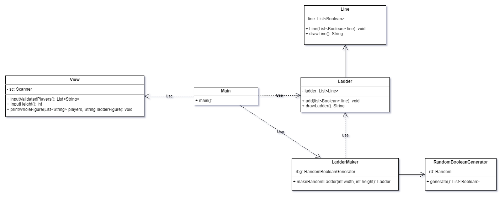

# Step 5 학습계획서
## Step 4 UML

## Step 5 학습 계획
이번 단계에서 제가 세운 목표는 크게 세가지 입니다. 
- 사다리의 결과를 계산하고 출력하는 로직 추가
- 세터의 삭제
- 리팩토링

이번 미션의 진행 순서는 다음과 같습니다.
### 1. 배경지식 학습
세터를 쓰지 말아야 하는 이유를 탐색할 예정입니다.  
또한 리팩토링에 관하여 오브젝트 책을 참고하여 녹여내 볼 생각입니다.
### 2. 사다리의 결과를 계산하고 출력하는 기능 추가
Ladeer와 Line클래스에 결과를 연산하는 메서드를 추가할 예정입니다.
### 3. Setter 리팩토링
세터를 거의 쓰지는 않았는데 Ladder 클래스에서 addLine이라는 메서드가 값을 계속 변경합니다.  
이를 리팩토링해서 고치려 합니다. 
### 4. 클래스 리팩토링
UML을 보면 메인 메서드는 Ladder, LadderMaker에 의존하고 있고, LadderMaker는 Ladder을 의존하고 있습니다.  
버뮤다 삼각지대처럼 블랙홀로 빨려들어가는 느낌인데, 이 구조를 리팩토링해서 깔끔한 구조를 만들 계획입니다.
### 5. 예외 처리(선택사항)
지금 프로그램에서는 이름이 5글자만 넘어갔는지를 검증하는 메서드 밖에 없습니다.  
좀더 많은 예외사항을 검증할 생각입니다.
