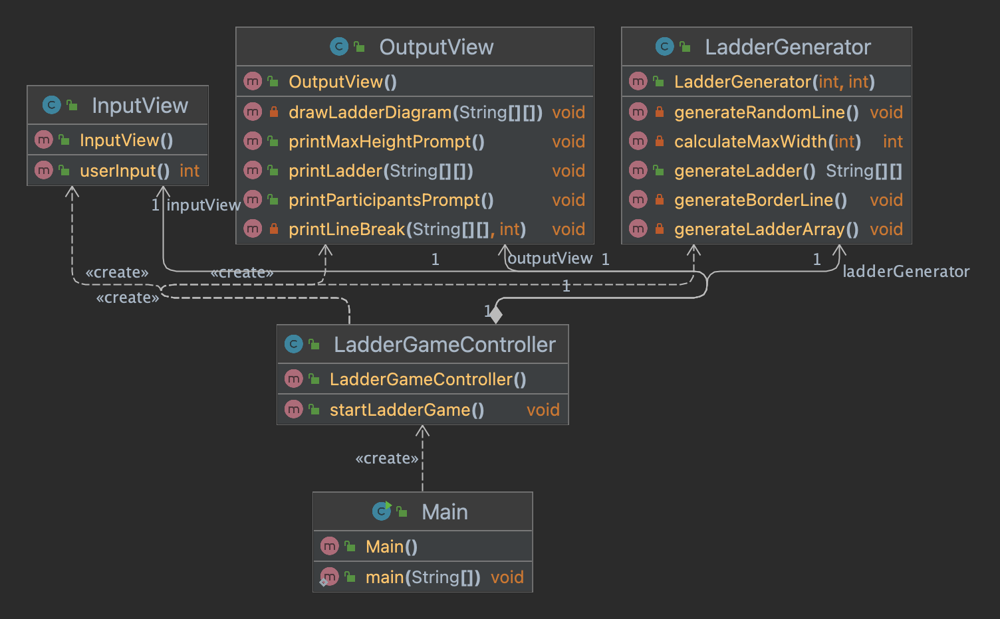

# java-ladder
2023 백엔드 자바 사다리게임 프로젝트

## 주의사항
- PR은 하루에 하나만, 한 PR에는 하나의 미션만 보내기
- 객체 간의 협력 중점으로 고민해보기

## 학습 내용
| 날짜          | 학습키워드          | 세부내용                               |
|-------------|----------------|------------------------------------|
| 23.03.06(월) | `git`          | - 브랜치 생성 및 포크<br/>- CLI 명령어        |
| 23.03.07(화) | `git`<br/>`OOP` | - PR<br/>- 오브젝트 들춰보기               |
| 23.03.08(수) | `enum`<br/>`OOP` | - enum 활용 사례<br/>- 오브젝트 1장 정독 후 정리 |
| 23.03.09(목) |                |                                    |


---
# 23.03.07 (화)
## 1단계 - 기본 기능 구현
### Check List
- [x] 참가자 인원을 입력할 수 있도록 한다.
- [x] 사다리 최대 개수를 입력할 수 있도록 한다.
- [x] 입력값을 기반으로 사다리 상태를 출력한다.
    - 2차원 배열 활용

## 2단계 - 리팩토링
### Check List
- [x] 네이밍 컨벤션을 잘 지켰는지?
- [ ] 최소한의 단위로 메서드를 분리했는지?(indent 2단계 이하)

### 작업 결과
- 좀 더 효율적이고 간결한 코드를 만들기 위한 방법 고민해보기(메서드를 더 분리해봐야 할지..)
```java
public class LadderGenerator {
  int maxHeight;
  int column;
  String[][] ladder;

  public LadderGenerator(int joinMembers, int maxHeight) {
    column = joinMembers + (joinMembers - 1);
    ladder = new String[this.maxHeight = maxHeight][column];
  }

  public String[][] generateLadder() {
    generateLadderArray();
    generateRandomLine();
    generateBorderLine();
    return ladder;
  }

  public void generateLadderArray() {
    ladder = new String[maxHeight][column];
    for (int i = 0; i < ladder.length; i++) {
      for (int j = 0; j < ladder[i].length; j++) {
        ladder[i][j] = " ";
      }
    }
  }

  public void generateRandomLine() {
    Random random = new Random();
    for (int i = 0; i < ladder.length; i++) {
      for (int j = 0; j < ladder[i].length; j++) {
        if (j % 2 != 0 && random.nextBoolean()) {
          ladder[i][j] = "-";
        }
      }
    }
  }

  public void generateBorderLine() {
    for (int i = 0; i < ladder.length; i++) {
      for (int j = 0; j < ladder[i].length; j++) {
        if (j % 2 == 0) {
          ladder[i][j] = "|";
        }
      }
    }
  }
}
```
---
# 23.03.09 (목)

## To-do
- [x] 학습계획 작성
- [x] 그룹리뷰 내용을 바탕으로 코드 개선하기 // 2단계
- [ ] `자바 문자열` 학습 후 정리
- [ ] `리스트와 제네릭` 학습 후 정리

## 그룹리뷰
>- IDE 메서드 분리 기능을 이용해 메서드 분리 연습과 코드 가독성 향상하기
>- 출력에 필요한 문자열을 상수 처리하기
>- main 메서드에서는 객체의 동작만 보이게끔 수정하기
>  - 생성자에서 new 연산자를 사용하는 방법이 있다.
>- 접근제어자를 신경써서 캡슐화, 객체 간 협력에 집중하도록 하기
>- naming과 커밋 메시지 신경쓰기

그룹리뷰를 준비하는 시간이 필요할 것 같다.  
준비되지 않은 상태에서 내가 고민했던 과정과 해결 과정을 조리있게 말하는게 쉽지 않았다.  
다음 리뷰부터는 내가 얘기하고자 하는 내용을 다듬어 간결하게 전달해서 동료들의 입장에서 피드백이 원활할 수 있도록 노력해보자.

## 2단계 - 리팩토링(그룹리뷰 반영)
### 이중 for문 없이 2차원 배열 출력
이중 for문 없이 2차원 배열을 다루는 방법을 계속해서 고민했지만 답이 나오지 않아 결국 구글링을 해봤다.   
하나의 for문으로만 2차원 배열을 출력하는 방법이 있어 **printLadderState()** 메서드에 적용해보았다.   
다른 방법을 좀 더 고민해봐야겠다..


- 참고자료: https://coozplz.me/2011/11/09/2%EC%B0%A8%EC%9B%90-%EB%B0%B0%EC%97%B4for%EB%AC%B8-%ED%95%98%EB%82%98%EB%A1%9C-%EC%B6%9C%EB%A0%A5/

### 작업 결과
이중 for문을 메서드로 분리해보려고 했지만 쉽지 않았다.   
인터페이스를 이용하면 좋을 것 같은데.. 인터페이스에 대해 잘 모르기도 하고   
시간이 많이 걸릴 것 같아 여기서 마무리하기로 했다.

```java
package kr.codesquad;

import java.util.Random;

public class LadderGenerator {
    private int maxHeight;
    private int maxWidth;
    private int rowIndex;
    private int columnIndex;
    private String[][] ladder;

    public LadderGenerator(int joinMembers, int maxHeight) {
        this.maxHeight = maxHeight;
        maxWidth = calculateMaxWidth(joinMembers);
    }

    public String[][] generateLadder() {
        ladder = new String[maxHeight][maxWidth];
        generateLadderArray();
        generateBorderLine();
        generateRandomLine();
        return ladder;
    }

    private int calculateMaxWidth(int joinMembers) {
        int maxWidth = joinMembers * 2 - 1;
        return maxWidth;
    }

    private void generateLadderArray() {
        for (rowIndex = 0; rowIndex < ladder.length; rowIndex++) {
            for (columnIndex = 0; columnIndex < ladder[rowIndex].length; columnIndex++) {
                ladder[rowIndex][columnIndex] = " ";
            }
        }
    }

    private void generateBorderLine() {
        for (rowIndex = 0; rowIndex < ladder.length; rowIndex++) {
            for (columnIndex = 0; columnIndex < ladder[rowIndex].length; columnIndex++) {
                if (columnIndex % 2 == 0) {
                    ladder[rowIndex][columnIndex] = "|";
                }
            }
        }
    }

    private void generateRandomLine() {
        Random random = new Random();
        for (rowIndex = 0; rowIndex < ladder.length; rowIndex++) {
            for (columnIndex = 0; columnIndex < ladder[rowIndex].length; columnIndex++) {
                if (columnIndex % 2 != 0 && random.nextBoolean()) {
                    ladder[rowIndex][columnIndex] = "-";
                }
            }
        }
    }
}
```


---
# 23.03.09(목)

## 공통 Feedback
- 네이밍 신경쓰기
  - 클래스 이름, public 메서드 이름
    - 간결하고 명확하게 의미를 전달할 수 있도록 하자.
  - 객체.메서드(매개변수) -> 주어.동사(목적어|보어) 느낌이 되도록 지어보자.
- magic 넘버 사용하지 않기
- 테스트 코드 작성
  - `@displayName` 어노테이션을 활용해서 테스트의 의도를 명확하게 표현하자.
- 여유가 되면 예외처리 다양하게 도전해보기
- 키워드 추천: `드미터의 법칙`, `일급 컬렉션`

## To-do
- [ ] 2차원 배열을 ArrayList로 변경하기
- [ ] 코어타임 이후 동료들과 오브젝트 읽기

## 그룹리뷰
- 다이어그램 활용하기.
- 꼭 2차원 List를 사용해야 하는 건 아니다.


## 3단계 - 사다리 모양 개선
### Check List
- [ ] 플레이어 이름 1~5글자로 제한하기 // 예외처리
- [ ] 플레이어 이름 ,(쉼표)로 구분 // 예외처리
- [ ] 사다리 라인 column당 최소 1개 생성하기
- [ ] 사다리 라인이 같은 row에 연속 생성되는 것 제한하기